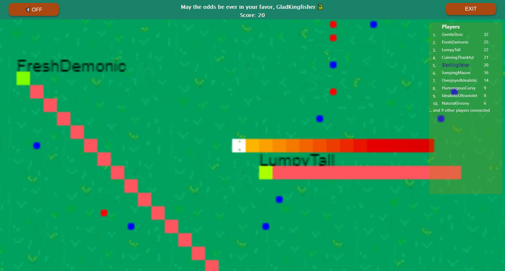

# Hunger Games

Hunger Games is a casual multiplayer online snake game with an io twist where the player eats food
while avoiding getting hit by other players. Includes 5 docker containers built in compose for a full-stack project: prometheus, cadvisor, 
mongodb, flask, react.

### Made by me and two other students. Fetched from a private repository.

## Live demo
Head over to [https://snake.args.no/](https://snake.args.no/) to try out a live demo where the game server is hosted on a heroku dyno. 
The database is hosted on MongoDB Atlas.
Please wait up to two minutes for the Heroku dyno to boot up.

## Quick start (for advanced users)
```
$ docker-compose up -d
```
Then visit [http://localhost:5000](http://localhost:5000/) in the browser to play.

## Installation
### Prerequisites
Before you start, make sure that you have installed docker:
* [Docker Desktop for Windows](https://docs.docker.com/windows/started)
* [Docker Desktop for Mac](https://docs.docker.com/docker-for-mac/)
* [Docker Engine for Linux](https://docs.docker.com/engine/install/)

Also make sure that [Docker Compose](https://docs.docker.com/compose/install/) is installed.
Docker Desktop for Windows and Docker Desktop for Mac usually includes compose.

### Verify docker install
To see if docker is succesfully installed and running, run this command in a terminal:
```
$ docker --version
```
To see if Docker Compose is successfully installed, one of those two commands should not return an error.
```
$ docker-compose --version
```
or
```
$ docker compose
```

### Start and run
Navigate to the project root and run one of these commands in the terminal depending on Docker version:
```
$ docker-compose up -d
```
or 
```
$ docker compose up -d
```


### Open game
From your preferred browser, go to [http://localhost:5000](http://localhost:5000/) to play. Remember to enable 
[#allow-insecure-localhost](chrome://flags/#allow-insecure-localhost) if you run Chrome, due to self-signed SSL certificate. 
Be aware that the containers might use some time to start, so leaderboard and gameserver might not be functional right away.

### Exit game
Navigate to the project root, and run depending on Docker version in a terminal:
```
$ docker-compose down
```
or
```
$ docker compose down
```

### Deleting all docker images and containers

WARNING! This will delete ALL docker images and containers, including those NOT associated with this project!
```
$ ./StopAndDeleteEveryDockerFile.sh
```

## Edit amount of bots
In docker-compose.yml at the root of the project, you can change the number of bots. In the snippet below, 20 bots will  start
each time you run the game. If you want to change this value, simply put a different number after NUMBOTS. It's recommended 
to have between 10 and 50 bots for the best gameplay. Remember to rebuild flask with `docker-compose up -d` after saving the new 
updated docker-compose.yml file. 
```yaml
  flask:
    container_name: flask
    build: ./server
    ports:
      - "8000:8000"
    environment:
      MONGODB_HOSTNAME: mongodb
      NUMBOTS: 20
    # don't start until mongodb container is up
    depends_on:
      - mongodb
    restart: unless-stopped
```

## Monitoring
cAdvisor is running on [http://localhost:8080](http://localhost:8080). To see container stats, navigate to "docker containers", 
then choose the container you want to monitor.

## Built with
* Nginx
* Mongodb
* React + socket.IO
* Python, socket.IO + flask + Eventlet
